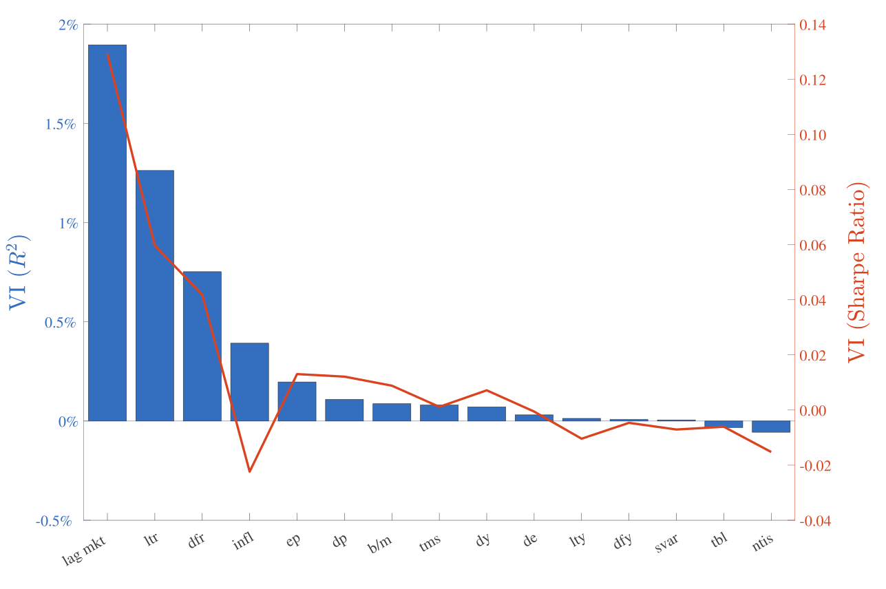

# Reproduction of "The Virtue of Complexity"  <!-- omit in toc -->

This project reproduces main empirical results from Kelly, Malamud and Zhou, 2024, "[The virtue of complexity in return prediction](https://doi.org/10.1111/jofi.13298)".

## TL;DR: <!-- omit in toc -->

The double descent appears in Random Fourier Features model with $l_2$ model for timing the stock market, in terms of statistical and financial performance metrics. The trading strategy that invests in the market with a position that is proportional to the forecasted returns (without limitations on leverage, no trading costs, etc.) has expected OOS Sharpe Ratio which is monotonically increasing with the complexity of the model (i.e. the number of parameters of the model). The strategy is trend-following, rarely goes short, and can time recessions. Thus, the heuristics of using simple instead of complex pricing models (but benignly overfitting models, such as RF model)  has no justification from the perspective preventing the risk of overfitting. **Note:** there are NO indications that random feature models outperform the simple ridge regression model. In fact, the random feature model in the context of forecasting returns (in the most cases) learns only a linear approximation of the true pricing function - and it does so very inefficiently.

- [Introduction](#introduction)
  - [General Setup](#general-setup)
- [Simulation steps](#simulation-steps)
  - [Data sources and preprocessing](#data-sources-and-preprocessing)
  - [Simulation implementation](#simulation-implementation)
- [Comparison of the original and reproduced results](#comparison-of-the-original-and-reproduced-results)
  - [Main results: VoC curves](#main-results-voc-curves)
    - [Figure 1: Sharpe ratio](#figure-1-sharpe-ratio)
    - [Figure 2: Beta](#figure-2-beta)
    - [Figure 3: ER](#figure-3-er)
    - [Figure 4: R2](#figure-4-r2)
    - [Figure 5: Volatility](#figure-5-volatility)
    - [Figure 6: Alpha](#figure-6-alpha)
    - [Figure 7: Alpha T-Statistic](#figure-7-alpha-t-statistic)
    - [Figure 8: Information ratio](#figure-8-information-ratio)
  - [Variable importance](#variable-importance)
  - [Timing recessions](#timing-recessions)
- [Code Overview](#code-overview)
- [Project Organization](#project-organization)

## Introduction

The common wisdom in econometrics advocates for the usage of a simpler model over a more complex one, given that the two models have similar performances. In the paper, the authors present a theoretical analysis of the expected out-of-sample risk of a model for return prediction for different model complexities. The analysis concludes that, under relatively broad assumptions, an increase in the complexity of overparametrized misspecified models guarantees improvement in the expected out-of-sample model performance. Additionally, the authors performed empirical analysis, which yielded results in agreement with the theoretical analysis of overparametrized misspecified models.

### General Setup

Let's assume there exists the true predictive model of returns

$$R_{t+1}= f(G_t) + \epsilon_{t+1}$$

where $R_{t+1}$ is an asset return at time $t+1$, $G$ is a set of predictive signals, and $f$ is a smooth function. If it is known what signals are in the set $G$, we will call it "correctly specified model", otherwise, if only a subset of signals are known, we will call such a model "misspecified". In both cases, $f$ is an unknown function.

We can try to approximate $f$ as

$$f(G_t) \approx \sum_{i=1}^P S_{i,t}\beta_i$$

where $S_{i,t} = \tilde{f}(\omega'_iG_t)$ is a nonlinear function, $\omega$ is a vector of weights. $P$ is the number of parameters $\beta_i$ of the model, and it will be used as a measure of the complexity of the model. As $P$ increases the approximation error decreases but the variance of the model will increase, leading to the well known problem of bias-variance trade-off. This would in theory lead to maximal variance as $P$ reaches the number of data points in the sample, $T$. For $P=T$ the model reaches zero in-sample loss, while the out-of-sample risk reaches its maximum.

With the further increase in complexity, we enter into $P>T$ regime (also known as "interpolation regime"), where the out-of-sample risk of certain models will to decrease ("double descent" effect). For more on this topic see [TBA].

In VoC paper authors provided the analysis of such an effect within the context of timing the stock market. There, the model is made to predict excess returns of SP500 index, and the prediction of the model is proportional to the position of the market timing strategy. In the proposition 5 and 6, the authors provided asymptotic results for the market timing strategy's expected returns, second moment of returns, SR, $R^2$, and leverage, in the case of $P,T,P_1 \rightarrow \infty$, but $P/T=c$ is fixed complexity, and $P_1/P=q$ is fixed ratio of informative and noninformative signals.

## Simulation steps

### Data sources and preprocessing

For the reproduction of the results I used the same data as in the original paper, which is the dataset from Welch and Goyal (2022). Preprocessing steps consists of volatility standardization of variables, lagging independent variables, and generating Random Fourier Features (RFFs). Dependent variable, i.e. excess returns of S\&P500 index, are standardized by their trailing 12-month standard deviation. For returns, we calculate standard deviation from the uncentered second moment, not variance. Predictors are standardized using an expanding window historical standard deviation. For details on data preprocessing steps see the following notebook [01-mz-preprocessing.ipynb](./notebooks/01-mz-preprocessing.ipynb). Links towards data sources and notes on raw data are available at [input_data_notes.md](./docs/notes/input_data_notes.md)

The second part of preprocessing is generating RFFs. A pair of RFFs is generated as:

$$S_{i,t} = [\sin (A_{i,t}), \cos (A_{i,t})]', \qquad \omega_i' \sim i.i.d.N(0,I_{15\times15}) $$

Where:

- $A_{i,t} = \gamma \omega_i' G_t$, is a matrix of dimension $T \times P/2$
- $S_{i,t}$ is the $i$-th pair of RFF at time $t$.
- $\gamma$ is the scaling factor. We set $\gamma = 2$ as in \cite{voc}.
- $\omega_i$ is the random vector, sampled from standard normal distribution.
- $G_t$ is the input feature at time $t$.
- $I_{15\times15}$ is the identity matrix of size $15\times15$.

For details, see [02-mz-generate-RFF.ipynb](./notebooks/02-mz-generate-RFF.ipynb).

### Simulation implementation

The least-squares estimators with $l_2$ regularization can be written as:

$$\hat{\beta}(z) = \left( zI + T^{-1} \sum_t S_t S_t' \right)^{-1} \frac{1}{T} \sum_t S_t R_{t+1}$$

Where $z$ is the shrinkage parameter of ridge regression.

The choice of method of computing the inverse matrix is critical for isolating double descent effects from noise of individual simulation runs. For more details on precision and speed of different solvers, see [03-mz-voc-curve.ipynb](./notebooks/03-mz-voc-curve.ipynb).

Authors of the original paper use the following method for fitting the ridge regression. For underparametrized regime ($P<=T$), they use common MATLAB implementation of singular value decomposition, and the usual procedure for fitting regularized least square. For overparametrized regime, authors implemented slightly different procedure so that the SVD function is applied to $T^{-1} X X^\prime$. I used the same implementation via `scipy.linalg.svd`. Both, MATLAB and Python implementations of SVD use the same LAPACK backend, which is achieved by setting  `lapack\_driver ='gesvd'` in `scipy.linalg.svd`. Nonetheless, a slight differences in stability are observed, as well as a slower execution of Python procedure. The impact to model performance is still unknown.

As in the original paper, we generate P=12,000 RFFs (6,000 pairs) for each seed. Subsets of those 12,000 RFFs are used for configuring models of different complexities. This is repeated for 1000 seeds, and final results are averaged over 1000 simulations.

Procedure for generating VoC curves for one seed value:

1. Generate 120000 RFFs using 'make\_ RFF'
2. For $t \in \{12, \dots, len(S)\}$:
   1. Standardize the RFFs by their standard deviation in the training sample i.e. sample $\{S_{t-T}, \dots S_{t-1}\}$ of the last $T$ observations, for $T \in \{12, 60, 120\}$. Also, standardize $S_{t}$ by the same standard deviation.
   2. Estimate the model by ridge regression with $P\in \{2,\dots, 12000\}$ and ridge shrinkage parameter $log_{10}(z) \in \{−3,\dots, 3\}$.
3. From the sequence of out-of-sample predictions and strategy returns from step 2. calculate:
   1. average $||\hat{\beta}||^2$ across training samples,
   2. out-of-sample $R^2$. Before calculating forecast errors, rescale forecasted returns back to the real scale (scale before standardization).
   3. out-of-sample average return of the timing strategy
   4. volatility of the timing strategy
   5. Sharpe ratio of the timing strategy (annualized)
   6. fit linear regression between rescaled strategy returns and actual returns. Record intercept as strategy's alpha, record its t statistic.
   7. calculate information ratio as ratio between strategy's alpha and the standard deviation of residuals of the regression from the previous step.

In order to calculate variable importance for each variable, we repeat the same process as described above but with leaving out one of 15 independent variables. This is repeated for each of 15 variable, and performance metrics ($R^2$ and Sharpe ratio) of submodels (model with a subset of 14 independent variables that go into RFFs generation) is calculated. This is done only for P=12,000; z=1000, and T=12. Relative changes in performance between full model and submodels is calculated. They are called VI($R^2$) and VI(Sharpe Ratio). 

## Comparison of the original and reproduced results

### Main results: VoC curves

#### Figure 1: Sharpe ratio

Original Results             |  Reproduced Results
:-------------------------:|:-------------------------:
  |  

#### Figure 2: Beta

Original Results             |  Reproduced Results
:-------------------------:|:-------------------------:
  |  

#### Figure 3: ER

Original Results             |  Reproduced Results
:-------------------------:|:-------------------------:
  |  

#### Figure 4: R2

Original Results             |  Reproduced Results
:-------------------------:|:-------------------------:
  |  

#### Figure 5: Volatility

Original Results             |  Reproduced Results
:-------------------------:|:-------------------------:
  |  

#### Figure 6: Alpha

Original Results             |  Reproduced Results
:-------------------------:|:-------------------------:
  |  

#### Figure 7: Alpha T-Statistic

Original Results             |  Reproduced Results
:-------------------------:|:-------------------------:
  |  

#### Figure 8: Information ratio

Original Results             |  Reproduced Results
:-------------------------:|:-------------------------:
  |  

### Variable importance

Original Results             |  Reproduced Results
:-------------------------:|:-------------------------:
  |  

In preprocessing we lagged inflation twice: one period more than the authors of the original paper did. This made `infl` variable less informative, so much so that its variable importance measured by a decrease in Sharpe Ratio is negative, meaning that omitting this variable would improve SR. The increase in complexity in VoC setup leads to an improvement in performance, but the complexity must not be increased by the addition of uninformative variables. The model can't  Some kind of variable selection is still necessary.

The importance of `mr` indicates the trend following behavior of the model. `ltr` (Long-Term Bond Returns) are important but long-term yields and the term spread are not. `dfr` is a difference between long-term corporate bond and long-term government bond returns. Again, yields are not important, but the returns on the bonds are. Seems like the model is capturing momentum in the bond market as well. `ep`, `dp` and `dy` (dividend/lagged prices) are important, but `de` is not. The first three variables are ratios of something to price (or lagged price), while `de` is not. Overall, seems like this model is mainly exploiting the momentum.

### Timing recessions

NBER recession indicator (gray vertical stripes) and 12-month smoothed average positions for P=12000, z=1000, T=12, 60, 120 strategies.

Seems like the model is not that bad in timing recessions. This is to be further investigated.

## Code Overview

There are two main parts of the project:

1. Code for running simulations and producing interim data. This code will output `.npy` objects to folders in `data/interim`. These are loaded and analyzed using the code from the second part of the project. 
   
   To run the main simulation navigate to the root of the project and run:

        python src/models/voc_simulation.py
    
    By running the main simulation, we repeatedly call individual simulations with different seeds. Before running the main simulation make sure to create a dedicated folder in `data/interim` for the given simulation, containing sub-folders like `beta_norm_sq`, `return_forecasts` and `configs`.  The main simulation will output `.npy` files to `beta_norm_sq` and `return_forecasts` folders. Each file will have a prefix matching the value of seed used for producing that particular output. The `configs` folder will contain configuration like `0123_config.json`, keeping track of parameters used in the each run. This allows for running stopping the main simulation (ie looping over seeds), and changing the parameters for the next run, such as fitness of the grid of model complexities, since convergence of results is problematic around interpolation threshold, and not so much in the region of high complexity. Parameters are sourced from the global `config.json` file, which is saved in `data/interim/XYZ` folder. It is global only for the particular `XYZ` simulation, not for the whole project. Look at the example in `simulation_outputs_voc_solver` for an example of how `cofing.json` should be formated.

    Before running the simulation also make sure to configure paths `path_to_processed` and `path_to_outputs` in the `voc_simulation.py`. The folder in `path_to_outputs` should contain a configuration file.

    Aside from the main simulation, there is a modification of the main simulation for calculating variable importance. This is done by running:

        python src/models/variable_importance.py

    The workflow is analogues to the main simulation, with the additional list `vars_to_exclude` in `config.json`.

2. Code for analyzing the output of the simulation and producing the main figures. This code is in the `src/visualization` folder, and you can run it by:

        python src/visualization/visualize.py

    Other plots, such as variable importance or "strategy's position vs NBER recession indicator" plots are produced using notebooks.

## Project Organization

    ├── README.md          
    ├── data
    │   ├── external       <- Data from the original paper, used for checking the preprocessing steps. 
    │   ├── interim        <- Outputs of simulation  (`voc_simulation.py`), and partially preprocessed
    │                         data (`formatted_goyal_data.csv`, `interim_nonstd_data.csv`).
    │   ├── processed      <- standardized version of `interim_nonstd_data.csv`, used for fitting models.
    │   └── raw            <- The original, immutable data dump 
    │
    ├── docs               
    │    ├── papers        
    │    └── notes          
    │
    ├── notebooks          <- Notebooks keep record of small details which are not presented in the
    │                         final report or the slide deck. 
    │                         Naming convention is a number (for ordering),
    │                         the creator's initials, and a short `-` delimited description, e.g.
    │                         `01-jqp-initial-data-exploration`.
    │    
    ├── reports            <- `.tex` and `.pdf` files for the final report and the slide deck 
    │   └── figures        <- Generated graphics and figures to be used for reporting
    │
    ├── requirements.txt   <- The requirements file for reproducing the analysis environment, e.g.
    │                         generated with `conda list -e > requirements.txt`
    └── src                <- Source code for use in this project.
        │
        ├── features       <- make RFFs
        │
        ├── models         <- the main scripts for fitting models for different seeds `voc_simulation.py`,
        │                     computing variable importance `variable_importance.py`, etc.  In the next
        │                     iterations of the project this will only host models, and wrapping them
        │                     into simulations will be done somewhere else.
        │
        ├── utils          <- tools for formatting data, computing variable importance, etc.
        │
        └── visualization  <- Scripts which take `.npy` files outputted from, compute metrics and
                              create main VoC figures 
--------
