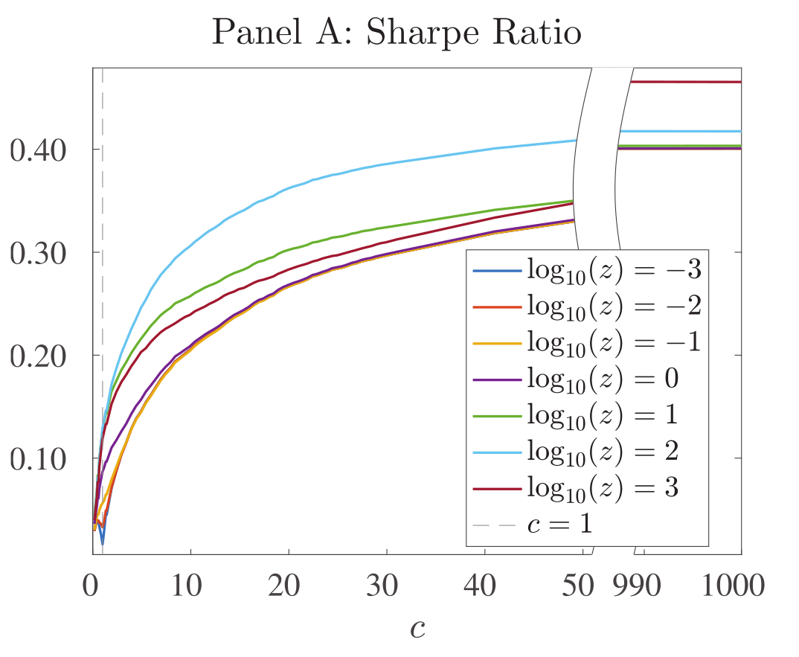

# Reproduction of "The Virtue of Complexity"

This project reproduces main empirical results from Kelly, Malamud and Zhou, 2023, "[The virtue of complexity in return prediction](https://ssrn.com/abstract=4410125)".

## Overview of the results

**Comments and conclusions to be added latter.**

## Results Comparison

#### Figure 1: Sharpe ratio

Original Results             |  Reproduced Results
:-------------------------:|:-------------------------:
  |  

#### Figure 2: Beta

Original Results             |  Reproduced Results
:-------------------------:|:-------------------------:
  |  

#### Figure 3: ER

Original Results             |  Reproduced Results
:-------------------------:|:-------------------------:
  |  

#### Figure 4: R2

Original Results             |  Reproduced Results
:-------------------------:|:-------------------------:
  |  

#### Figure 5: Volatility

Original Results             |  Reproduced Results
:-------------------------:|:-------------------------:
  |  

#### Figure 6: Alpha

Original Results             |  Reproduced Results
:-------------------------:|:-------------------------:
  |  

#### Figure 7: Alpha T-Statistic

Original Results             |  Reproduced Results
:-------------------------:|:-------------------------:
  |  

#### Figure 8: Information ratio

Original Results             |  Reproduced Results
:-------------------------:|:-------------------------:
  |  

## Code Overview

There are two main parts of the project:

1. Code for running simulations and producing interim data. This code will output `.npy` objects to folders in `data/interim`. These are loaded and analyzed using the code from the second part of the project. 
   
   To run the main simulation navigate to the root of the project and run:

        python src/models/voc_simulation.py
    
    By running the main simulation, we repeatedly call individual simulations with different seeds. Before running the main simulation make sure to create a dedicated folder in `data/interim` for the given simulation, containing sub-folders like `beta_norm_sq`, `return_forecasts` and `configs`.  The main simulation will output `.npy` files to `beta_norm_sq` and `return_forecasts` folders. Each file will have a prefix matching the value of seed used for producing that particular output. The `configs` folder will contain configuration like `0123_config.json`, keeping track of parameters used in the each run. This allows for running stopping the main simulation (ie looping over seeds), and changing the parameters for the next run, such as fitness of the grid of model complexities, since convergence of results is problematic around interpolation threshold, and not so much in the region of high complexity. Parameters are sourced from the global `config.json` file, which is saved in `data/interim/XYZ` folder. It is global only for the particular `XYZ` simulation, not for the whole project. Look at the example in `simulation_outputs_voc_solver` for an example of how `cofing.json` should be formated.

    Before running the simulation also make sure to configure paths `path_to_processed` and `path_to_outputs` in the `voc_simulation.py`. The folder in `path_to_outputs` should contain a configuration file.

    Aside from the main simulation, there is a modification of the main simulation for calculating variable importance. This is done by running:

        python src/models/variable_importance.py

    The workflow is analogues to the main simulation, with the additional list `vars_to_exclude` in `config.json`.

2. Code for analyzing the output of the simulation and producing the main figures. This code is in the `src/visualization` folder, and you can run it by:

        python src/visualization/visualize.py

    Other plots, such as variable importance or "strategy's position vs NBER recession indicator" plots are produced using notebooks.

## Project Organization

    ├── README.md          
    ├── data
    │   ├── external       <- Data from the original paper, used for checking the preprocessing steps. 
    │   ├── interim        <- Outputs of simulation  (`voc_simulation.py`), and partially preprocessed
    │                         data (`formatted_goyal_data.csv`, `interim_nonstd_data.csv`).
    │   ├── processed      <- standardized version of `interim_nonstd_data.csv`, used for fitting models.
    │   └── raw            <- The original, immutable data dump 
    │
    ├── docs               
    │    ├── papers        
    │    └── notes          
    │
    ├── notebooks          <- Notebooks keep record of small details which are not presented in the
    │                         final report or the slide deck. 
    │                         Naming convention is a number (for ordering),
    │                         the creator's initials, and a short `-` delimited description, e.g.
    │                         `01-jqp-initial-data-exploration`.
    │    
    ├── reports            <- `.tex` and `.pdf` files for the final report and the slide deck 
    │   └── figures        <- Generated graphics and figures to be used for reporting
    │
    ├── requirements.txt   <- The requirements file for reproducing the analysis environment, e.g.
    │                         generated with `conda list -e > requirements.txt`
    └── src                <- Source code for use in this project.
        │
        ├── features       <- make RFFs
        │
        ├── models         <- the main scripts for fitting models for different seeds `voc_simulation.py`,
        │                     computing variable importance `variable_importance.py`, etc.  In the next
        │                     iterations of the project this will only host models, and wrapping them
        │                     into simulations will be done somewhere else.
        │
        ├── utils          <- tools for formatting data, computing variable importance, etc.
        │
        └── visualization  <- Scripts which take `.npy` files outputted from, compute metrics and
                              create main VoC figures 
--------
